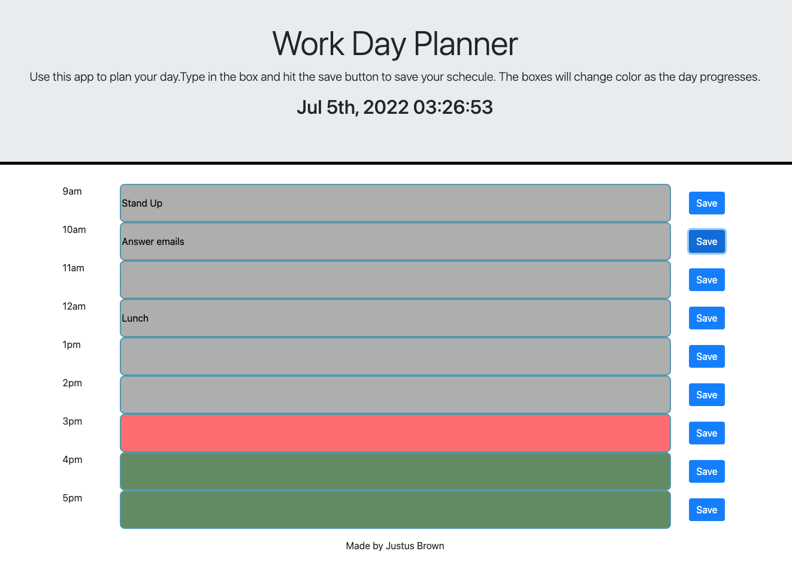

# 05 Third-Party APIs: Work Day Scheduler

## Your Task

In this activity, I was taksed with creating a simple calendar application. It needed to save events on the hourly scale to local storage. I used bootstrap, jquery, CSS, and [Moment.js](https://momentjs.com/) for this project. 

To operate the application, please follow this [link](https://brownj47.github.io/work-day-planner/). After the application loads, add text to the hourly time blocks. If you want the information you have entered to save, hit the save button. Saved information will persist through page reloads. As the day progresses, the hour boxes will change color. Past hours will be grey, the present hour will be red, and future hours will be green.




### The following are the requirements for my deployed application:

## User Story

```md
AS AN employee with a busy schedule
I WANT to add important events to a daily planner
SO THAT I can manage my time effectively
```

## Acceptance Criteria

```md
GIVEN I am using a daily planner to create a schedule
WHEN I open the planner
THEN the current day is displayed at the top of the calendar
WHEN I scroll down
THEN I am presented with timeblocks for standard business hours
WHEN I view the timeblocks for that day
THEN each timeblock is color coded to indicate whether it is in the past, present, or future
WHEN I click into a timeblock
THEN I can enter an event
WHEN I click the save button for that timeblock
THEN the text for that event is saved in local storage
WHEN I refresh the page
THEN the saved events persist
```
